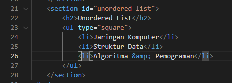
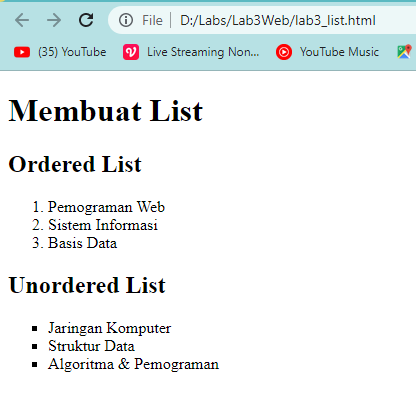
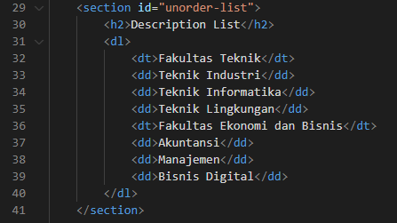
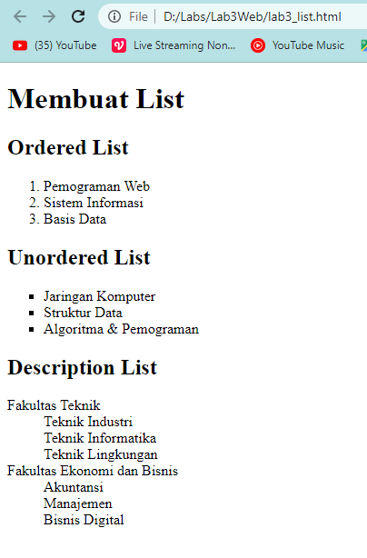
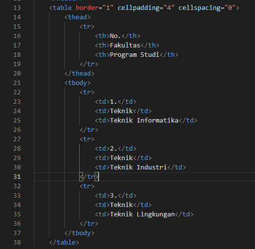
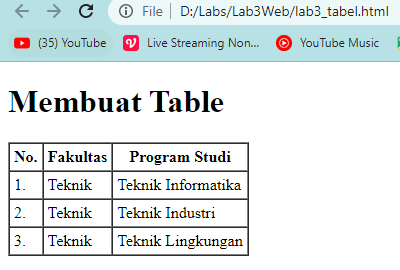

# Lab3Web
Latihan_3 23-3-2022

## Belajar Membuat List

### Ordered List
Langkah pertama membuat dokumen HTML, kemudian untuk kode tag yang digunakan untuk membuat Ordered List adalah `<ol>`, berikut contoh kodingannya.

Tampilan website nya seperti ini

### Unorderd List
Kemudian tambakan kode untuk membuat Unordered List dengan kode tag `<ul>`, setelah deklarasi ordered list pada Section unordered-list, seperti berikut.

Tampilan website nya seperti ini

### Description List
Kode tag yang digunakan untuk deskripsi list adalah `<dl>`, seperti berikut.

Tampilan website nya seperti ini

## Belajar Membuat Tabel

Membuat file baru kemudian membuat table dengan kode-kode sebagai berikut:
- `<table>`        : Mendefinisikan sebuah tabel dalam dokumen HTML. Atribut: border, cellpadding, cellspacing
- `<thead>`        : untuk membungkus bagian kepala tabel
- `<tbody>`        : untuk membungkus bagian body dari tabel
- `<th>`           : Membuat judul kolom
- `<tr>`           : Mendefinisikan baris dalam tabel
- `<td>`           : Mendefinisikan kolom tabel
Untuk mengatur margin dan padding pada cel data, tambahkan atribut cellpadding dan cellspacing pada tag table.
Untuk contohnya sebagai berikut

Tampilan website nya seperti ini

