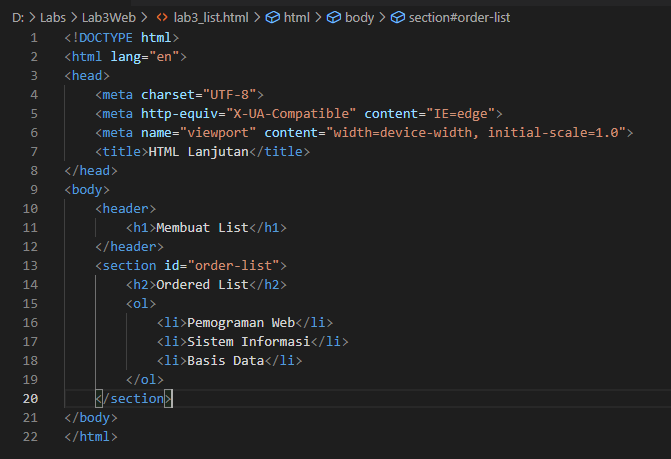
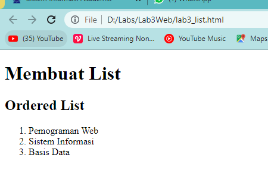

# Lab3Web
Latihan_3 23-3-2022

## Belajar Membuat List

### Ordered List
Langkah pertama membuat dokumen HTML, kemudian untuk kode tag yang digunakan untuk membuat Ordered List adalah `<ol>`, berikut contoh kodingannya

Tampilan website nya seperti ini

b